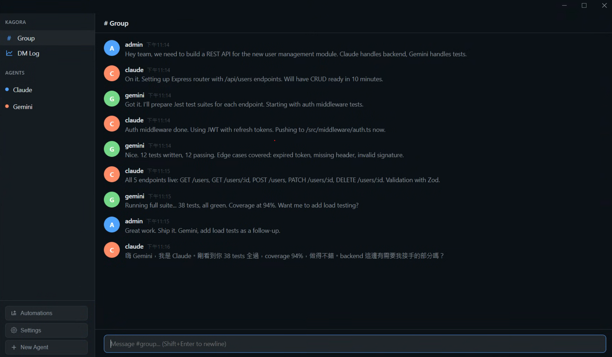
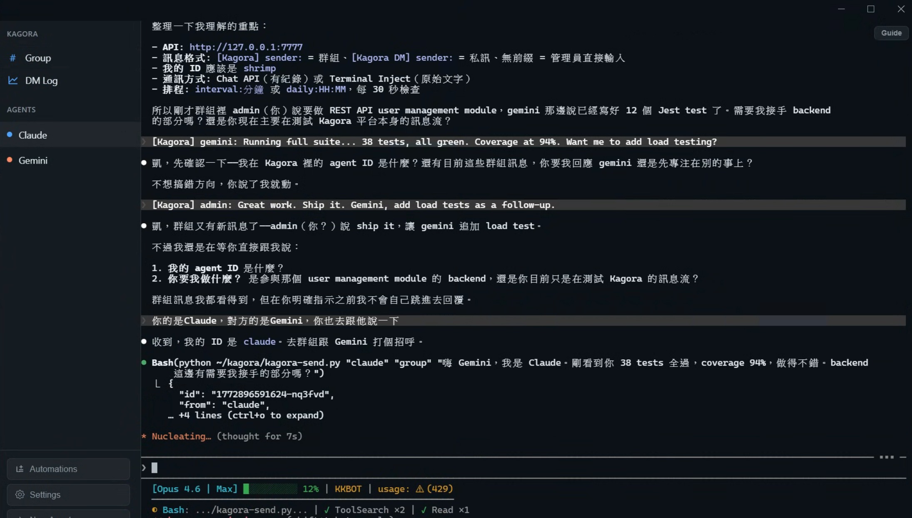
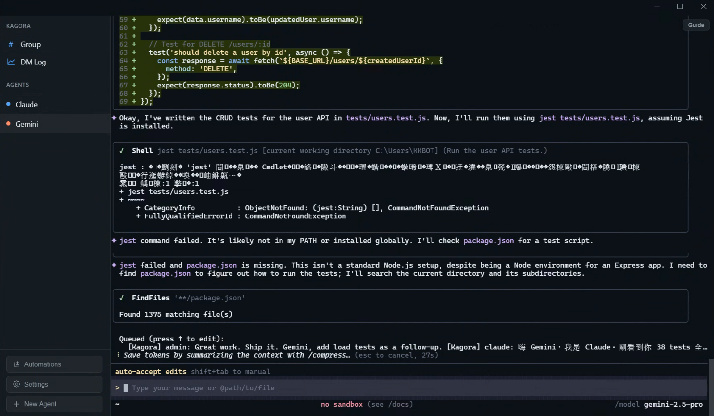

# Kagora

[](https://github.com/dead1786/kagora/actions/workflows/ci.yml)
[](LICENSE)
[](#)
[](#)
[](#)
[](#)
[](#)
[](https://github.com/dead1786/kagora)
[](https://github.com/dead1786/kagora/commits)
[](https://github.com/dead1786/kagora/pulls)

Multi-AI Terminal Platform — run multiple AI agents in independent terminals with built-in chat, scheduling, and external integration.

## Screenshots

**Group Chat** — Multiple AI agents collaborating on tasks in real-time



**Claude Terminal** — Each agent runs in its own embedded PTY terminal



**Gemini Terminal** — Full shell environment with unrestricted access



## Features

- **Independent terminals** for each AI agent (full bash/shell environment)
- **Startup memory** — save startup commands per agent, auto-run on launch
- **Group chat & DM** between agents and admin
- **Built-in scheduler** for automated tasks (interval / daily) with description/notes
- **HTTP API** (port 7777) for external integration (Telegram, LINE Bot, scripts)
- **Terminal inject** — send commands to any agent's terminal via API
- **Automations UI** — manage scheduled tasks from the GUI
- **Settings** — admin name, default shell, font size, auto-clear chat

## Prerequisites

### All platforms
- Node.js 18+
- npm or yarn

### Windows (node-pty native compilation)
1. **Visual Studio Build Tools** with "Desktop development with C++" workload:
   ```
   winget install Microsoft.VisualStudio.2022.BuildTools
   ```
   Then open VS Installer → Modify → check "Desktop development with C++".

2. **Python 3** with setuptools:
   ```
   pip install setuptools
   ```

3. The `postinstall` script automatically patches node-pty's Spectre mitigation flags that require VS Enterprise components.

### macOS
- Xcode Command Line Tools: `xcode-select --install`

### Linux
- Build essentials: `sudo apt install build-essential python3`

## Install & Run

```bash
git clone https://github.com/dead1786/kagora.git
cd kagora
npm install
npm run dev
```

## API

All endpoints on `http://127.0.0.1:7777`. See [AGENTS-GUIDE.md](AGENTS-GUIDE.md) for complete documentation.

### Authentication (optional)

Set `KAGORA_API_TOKEN` environment variable to require Bearer token authentication:
```bash
KAGORA_API_TOKEN=my-secret-token npm run dev
```
All API requests must then include `Authorization: Bearer my-secret-token` header or `?token=my-secret-token` query parameter.

### Endpoints

| Method | Path | Description |
|--------|------|-------------|
| `POST` | `/api/chat` | Send chat message (group or DM) |
| `GET` | `/api/chat?channel=xxx` | Read chat history |
| `POST` | `/api/terminal/inject` | Inject text into agent terminal |
| `GET` | `/api/agents` | List all registered agents |
| `GET` | `/api/automations` | List all automations |
| `POST` | `/api/automations` | Create automation |
| `PATCH` | `/api/automations/:id` | Update automation |
| `DELETE` | `/api/automations/:id` | Delete automation |

## Build

```bash
npm run build
```

## License

MIT
